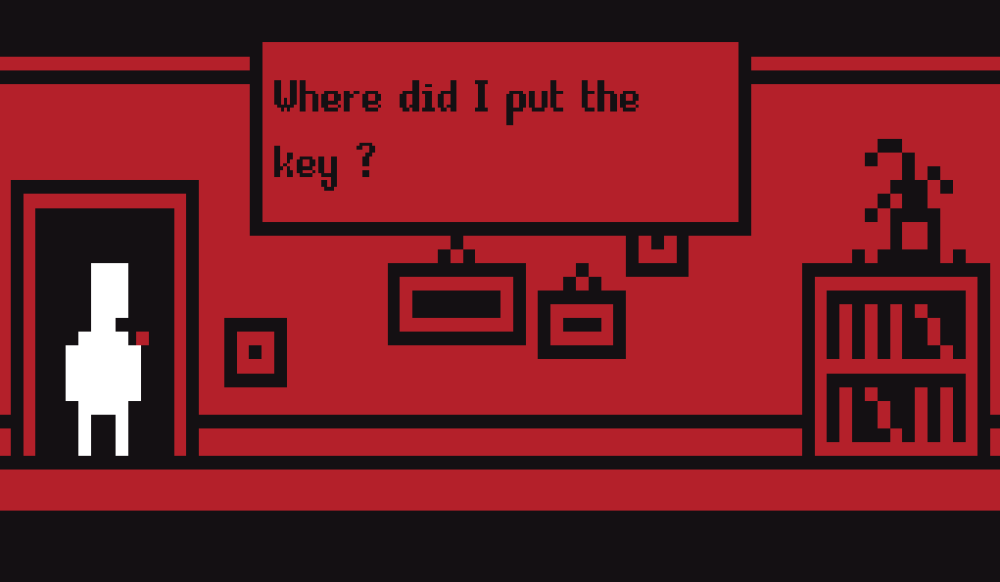

# Stevepixelface Example

Its a [Godot](https://godotengine.org)'s project aiming to provide example
of use of [Rakugo Dialogue System](https://github.com/rakugoteam/Rakugo-Dialogue-System). 
You can simply take a look, or copy and customize them for your games !

Inspired by this godot tutorial https://www.youtube.com/watch?v=Ur9j3c5_of0

## Info

If you want to help please write to us on our [Discord](https://discord.gg/K9gvjdg).

- Rakugo Team website: https://rakugoteam.github.io/
